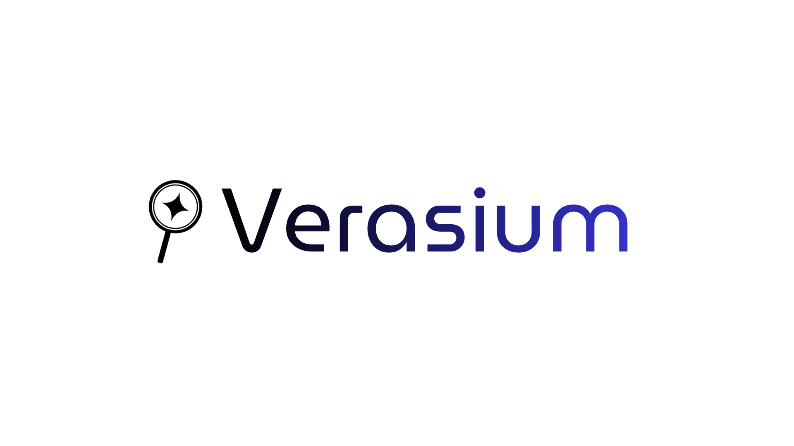

  

<h2 align="center">Software de Detecção de Conteúdo Gerado por IA    
  https://verasium.bryansiim.com.br</h2>

O **Verasium** é um software desenvolvido em **C# (.NET 9)** com frontend em **React** para detecção de conteúdo sintético (gerado por Inteligência Artificial).  
Ele identifica textos, imagens, PDFs, vídeos e áudios artificiais através da **leitura de metadados**, **análise multimodal via Google Gemini** e **análises heurísticas**.  

---

## Status do Projeto  
**Versão Beta – em desenvolvimento ativo.**  
Funcionalidades principais já implementadas, incluindo API REST, interface web e suporte a múltiplos tipos de mídia.  

---

## Arquitetura  

O projeto é organizado em três camadas:  

- **Verasium.Api** — API REST em ASP.NET Core (backend)  
- **Verasium.Core** — Lógica de análise e serviços compartilhados  
- **Verasium.Web** — Interface web em React 19 + Vite  

---

## Funcionalidades Atuais  
- Análise de **textos, imagens, PDFs, vídeos e áudios**  
- Extração e leitura de metadados (EXIF, XMP, C2PA)  
- Análise multimodal via **Google Gemini 2.5 Flash**  
- Extração de texto e imagens de PDFs  
- API REST com upload de arquivos  
- Interface web moderna com React  
- Geração de score de confiança baseado em múltiplos indicadores  
- Containerização com Docker  

---

## Tecnologias Utilizadas  
- **Linguagem:** C#, JavaScript  
- **Backend:** ASP.NET Core (.NET 9)  
- **Frontend:** React 19, Vite 7  
- **IA:** Google Gemini 2.5 Flash (via Google.GenAI)  
- **Infraestrutura:** Docker  

---

## Bibliotecas e APIs Externas  

Este software utiliza as seguintes bibliotecas e APIs de terceiros:  

1. **Google.GenAI**  
   - Licença: Apache 2.0  
   - Copyright (c) Google LLC  

2. **MetadataExtractor**  
   - Licença: Apache 2.0  
   - Copyright (c) Drew Noakes  

3. **UglyToad.PdfPig**  
   - Licença: Apache 2.0  
   - Copyright (c) UglyToad  

Esses serviços externos são utilizados apenas por meio de chamadas de API e **não são redistribuídos** com este software.  
Seus respectivos termos e licenças permanecem válidos e independentes do código-fonte deste projeto, que está sob **GPLv3**.  

---

## Contribuição  
O Verasium é um projeto **open source** e contribuições são bem-vindas!  
Sinta-se à vontade para abrir **issues** para reportar bugs ou sugerir melhorias, e enviar **pull requests** com suas contribuições.  

---

## Licença  
Este projeto é licenciado sob os termos da **GNU General Public License v3.0 (GPLv3)**.  
Para mais informações, consulte o arquivo [LICENSE](./LICENSE).  
